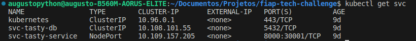
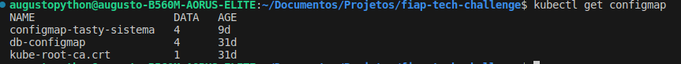
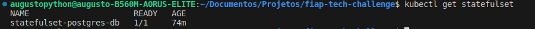
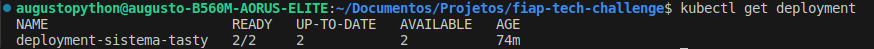
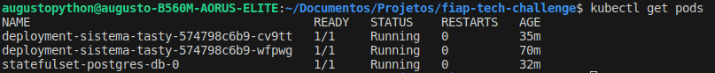
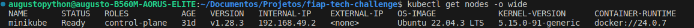
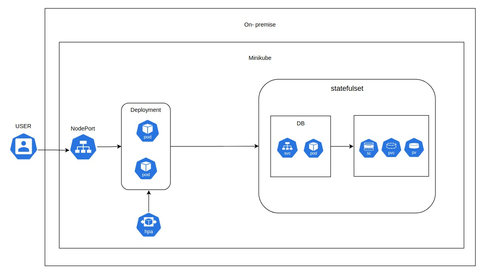

# Tasty Delivery 🍕

App que conecta clientes ao restaurante Tasty, sem passar pela
camada de atendimento presencial.

### :: Buildando e rodando o projeto

**`docker-compose up `**

### :: Acessando a documentação

- Disponível em `localhost:8000/docs` e/ou `localhost:8000/redoc`

### Postman

### Documentação WORD

[Documentação](https://docs.google.com/document/d/1aGpq26gV_-5NqVgCxIWloruXr-YnNfkn-rSJ9hvTfsY/edit)

### Kubernetes

Para execução será levado em conta que o ambiente já esteja instalado um kubernetes.
caso precise instalar segue link da documentação:
https://minikube.sigs.k8s.io/docs/start/

Para facilitar os comando configurar um Alias -> "alias kubectl="minikube kubectl --", caso contrário todos os comando que estiverem com "kubectl" deverá ser alterado para "minikube kubectl --"

1º O ambiente deve estar em execução comando -> "minikube start"

2º Deve ser iniciada a API para que seja possível executar os comandos de criação, execução e retorno dos serviços. comando -> "kubectl proxy"

3º Habilitar addons : csi-hostpath-driver, default-storageclass, metrics-server, storage-provisioner, volumesnapshots
    - para lista os addons e verificar se estão habilitados ou não comando -> "minikube addons list"
    - Para habilitar os addons o comando é -> "minikube addons enable (nome-do-addon)"

Para evitar erros realizar a execução dos serviços com na sequência a seguir:

- Deve ser executado os arquivos com nomenclatura iniciada em "svc-" dentro do diretório k8s do projeto
    - kubectl apply -f k8s/svc- ...
    Para verificar se o serviço está sendo executado comando -> "kubectl get svc"

    
    
- Deve ser executado os arquivos com nomenclatura iniciada em "configmap-" dentro do diretório k8s do projeto
    - kubectl apply -f k8s/configmap- ...
    Para verificar se o serviço está sendo executado comando -> "kubectl get configmap"

    

- Deve ser executado os arquivos com nomenclatura iniciada em "statefulset-" dentro do diretório k8s do projeto
    - kubectl apply -f k8s/configmap- ...
    Para verificar se o serviço está sendo executado comando -> "kubectl get statefulset"

    

- Deve ser executado os arquivos com nomenclatura iniciada em "deployment-" dentro do diretório k8s do projeto
    - kubectl apply -f k8s/deployment- ...
    Para verificar se o serviço está sendo executado comando -> "kubectl get deployment"

    

Neste momento a aplicação deverá estar com 3 pods em execução.
    2 pods do sistema
    1 pod do banco de dados

    comando para verificar -> "kubectl get pods"

    

para verificar o funcionamento do projeto é preciso acessar o ip do servidor do minikube.
    para verificar o ip(INTERNAL-IP) comando -> "kubectl get nodes -o wide"

    

Será necessário utilizar a porta configurada para acessar o servidor, no caso deste projeto foi configurado um nodePort : 30001

"INTERNAL-IP":30001/docs

### Desenho arquitetura infra

